# Yjs Collaboration Server

English | [中文](README_zh.md)

[](https://www.rust-lang.org/) [](LICENSE)

High-performance real-time collaborative document editing server built with Rust, Yrs (the Rust implementation of Yjs), and Volo HTTP & gRPC.

## ✨ Features

- 🚀 Real-time Collaboration: Multiple clients can edit the same document simultaneously.
- 🔄 CRDT-based: Conflict-free Replicated Data Types ensure consistency across replicas.
- ⚡ High Performance: Leveraging Rust and asynchronous programming for maximum throughput.
- 🌐 WebSocket Support: Real-time bidirectional communication over HTTP (`/ws` endpoint).
- 🎧 gRPC Support: Bi-directional streaming and unary RPC for collaboration (`Collaborate`, `GetDocumentState`, `GetActiveUsers`).
- 🏗️ Clean Architecture: Clear separation of domain, application, and infrastructure layers.
- 🔒 Type Safety: Rust's strong type system prevents many classes of bugs.
- ⚙️ Configurable: Control HTTP/gRPC endpoints, log level, and feature toggles via environment variables.

## 📦 Key Dependencies

- **volo** / **volo-http** / **volo-grpc**: Core HTTP & RPC framework.
- **yrs**: Rust implementation of the Yjs CRDT protocol.
- **tokio** / **futures-util**: Async runtime and utilities.
- **serde** / **sonic-rs**: JSON serialization/deserialization.
- **once_cell**: Lazy static initialization.
- **uuid** / **base64**: Client/document identifiers and payload encoding.
- **tracing** / **tracing-subscriber**: Structured logging and diagnostics.
- See full list in `Cargo.toml`.

## 🚧 Roadmap

- [ ] Infrastructure

  - [ ] Caching
    - [ ] Support Redis
    - [ ] Support multi-level caching
  - [ ] Storage
    - [ ] Support MySQL
    - [ ] Support MongoDB

- [ ] Connectivity

  - [ ] Heartbeat
  - [ ] Rate limiting

- [ ] Logging & Monitoring

  - [ ] Dynamic log level adjustment
  - [ ] Integrate metrics collection (e.g. Prometheus)

- [ ] Deployment

  - [ ] Docker image
  - [ ] Kubernetes deployment

- [ ] Testing

  - [ ] Unit test coverage
  - [ ] Integration tests

- [ ] Performance Optimization
  - [ ] Algorithmic improvements
    - [ ] Delta-only updates
    - [ ] Compress small updates
  - [ ] Concurrency optimizations
    - [ ] Lock-free or fine-grained locks
    - [ ] Reduce context switches
  - [ ] Resource pooling

- [ ] Server Register & Config
  - [ ] Nacos

## 🏗️ Architecture

### Domain Layer
- `domain/entities`: Core models and structures.
- `domain/repositories`: Repository interfaces.
- `domain/services`: Business logic and document management.

### Application Layer
- `application/config`: Configuration and environment variables.
- `application/container`: Dependency injection and wiring.
- `application/bootstrap.rs`: Application startup logic.
- `application/servers`: HTTP and gRPC server implementations.
- `application/use_cases`: Document synchronization use cases.

### Infrastructure Layer
- `infrastructure/adapters`: Concrete implementations (in-memory, cache, database).

### Adapter Layer
- **HTTP**: `adapter/http` - Health check (`GET /`) and WebSocket (`GET /ws`) endpoints.
- **WebSocket**: `adapter/http/websocket` - Handles Yjs JSON protocol over WebSocket.
- **gRPC**: `adapter/rpc` - Implements the Protobuf-defined `CollaborationService`.


## Detailed Request Flow
+Below is a sequence diagram showing how client requests flow through the WebSocket and gRPC adapters to the document use cases and how responses are returned.

```mermaid
sequenceDiagram
    participant Client as gRPC Client
    participant Adapter as CollaborationServiceImpl
    participant UseCase as CollaborationUseCases
    participant SessionRepo as SessionRepository
    participant DocRepo as DocumentRepository
    participant EventBus as Event Broadcaster
    
    Note over Client,EventBus: 用户加入文档协同编辑流程
    
    Client->>+Adapter: JoinDocument Request
    Adapter->>+UseCase: join_document()
    UseCase->>+SessionRepo: check existing session
    SessionRepo-->>-UseCase: no existing session
    UseCase->>UseCase: create CollaborationSession
    UseCase->>+SessionRepo: add_session()
    SessionRepo-->>-UseCase: success
    UseCase->>UseCase: create UserJoinedDocument event
    UseCase-->>-Adapter: return event
    Adapter->>+EventBus: broadcast event
    EventBus->>EventBus: convert to gRPC message
    EventBus-->>Client: UserJoined notification
    EventBus-->>Client: broadcast to other clients
    Adapter-->>-Client: success response
    
    Note over Client,EventBus: 文档更新流程
    
    Client->>+Adapter: UpdateMessage
    Adapter->>+UseCase: handle_document_update()
    UseCase->>+SessionRepo: get session by client_id
    SessionRepo-->>-UseCase: return session
    UseCase->>UseCase: update session last_seen
    UseCase->>+SessionRepo: update_session()
    SessionRepo-->>-UseCase: success
    UseCase->>+DocRepo: get_or_create document
    DocRepo-->>-UseCase: return document service
    UseCase->>UseCase: apply Y.js update
    UseCase->>UseCase: create DocumentUpdated event
    UseCase-->>-Adapter: return event
    Adapter->>+EventBus: broadcast event
    EventBus-->>Client: update notification
    EventBus-->>Client: broadcast to other clients
    Adapter-->>-Client: success
    
    Note over Client,EventBus: 客户端断开连接
    
    Client->>+Adapter: disconnect
    Adapter->>+UseCase: leave_document()
    UseCase->>+SessionRepo: get session by client_id
    SessionRepo-->>-UseCase: return session
    UseCase->>+SessionRepo: remove_session()
    SessionRepo-->>-UseCase: success
    UseCase->>UseCase: create UserLeftDocument event
    UseCase-->>-Adapter: return event
    Adapter->>+EventBus: broadcast event
    EventBus-->>Client: user left notification
    Adapter-->>-Client: cleanup complete
```

```mermaid
flowchart TD
    Start([gRPC客户端连接]) --> Auth{身份验证}
    Auth -->|验证失败| AuthFail[返回认证错误]
    Auth -->|验证成功| Connect[建立双向流连接]
    
    Connect --> Listen[监听客户端消息]
    Listen --> MsgType{消息类型判断}
    
    %% Join Document Flow
    MsgType -->|JoinDocument| ValidateJoin{验证加入请求}
    ValidateJoin -->|验证失败| JoinError[返回验证错误]
    ValidateJoin -->|验证成功| CheckSession{检查现有会话}
    CheckSession -->|已存在会话| SessionExists[返回会话已存在错误]
    CheckSession -->|无现有会话| CreateSession[创建协同编辑会话]
    CreateSession --> SaveSession[保存会话到仓储]
    SaveSession --> EmitJoinEvent[发布用户加入事件]
    EmitJoinEvent --> BroadcastJoin[广播加入消息给其他客户端]
    BroadcastJoin --> Listen
    
    %% Document Update Flow
    MsgType -->|UpdateMessage| ValidateUpdate{验证更新数据}
    ValidateUpdate -->|验证失败| UpdateError[返回更新错误]
    ValidateUpdate -->|验证成功| GetSession[获取客户端会话]
    GetSession -->|会话不存在| NoSession[返回会话不存在错误]
    GetSession -->|会话存在| UpdateLastSeen[更新最后活跃时间]
    UpdateLastSeen --> ApplyUpdate[应用Y.js更新到文档]
    ApplyUpdate -->|应用失败| ApplyError[返回应用错误]
    ApplyUpdate -->|应用成功| EmitUpdateEvent[发布文档更新事件]
    EmitUpdateEvent --> BroadcastUpdate[广播更新给其他客户端]
    BroadcastUpdate --> Listen
    
    %% Awareness Update Flow
    MsgType -->|AwarenessUpdate| ProcessAwareness[处理感知信息更新]
    ProcessAwareness --> EmitAwarenessEvent[发布感知更新事件]
    EmitAwarenessEvent --> BroadcastAwareness[广播感知信息]
    BroadcastAwareness --> Listen
    
    %% Sync Request Flow
    MsgType -->|SyncRequest| ProcessSync[处理同步请求]
    ProcessSync --> GetSyncData[获取同步数据]
    GetSyncData --> SendSyncResponse[发送同步响应]
    SendSyncResponse --> Listen
    
    %% Heartbeat Flow
    MsgType -->|HeartBeat| UpdateHeartbeat[更新心跳时间]
    UpdateHeartbeat --> Listen
    
    %% Leave Document Flow
    MsgType -->|LeaveDocument| ProcessLeave[处理离开请求]
    ProcessLeave --> RemoveSession[移除会话]
    RemoveSession --> EmitLeaveEvent[发布用户离开事件]
    EmitLeaveEvent --> BroadcastLeave[广播离开消息]
    BroadcastLeave --> Listen
    
    %% Disconnect Flow
    Listen --> Disconnect{客户端断开?}
    Disconnect -->|是| Cleanup[清理客户端会话]
    Cleanup --> End([连接结束])
    Disconnect -->|否| Listen
    
    %% Background Processes
    subgraph "后台任务"
        CleanupTask[定期清理过期会话]
        MonitorTask[连接监控]
        MetricsTask[性能指标收集]
    end
    
    %% Error Handling
    AuthFail --> End
    JoinError --> Listen
    SessionExists --> Listen
    UpdateError --> Listen
    NoSession --> Listen
    ApplyError --> Listen
    
    %% Styling
    classDef success fill:#d4edda,stroke:#28a745,stroke-width:2px
    classDef error fill:#f8d7da,stroke:#dc3545,stroke-width:2px
    classDef process fill:#d1ecf1,stroke:#17a2b8,stroke-width:2px
    classDef decision fill:#fff3cd,stroke:#ffc107,stroke-width:2px
    
    class Start,Connect,CreateSession,SaveSession,ApplyUpdate,End success
    class AuthFail,JoinError,SessionExists,UpdateError,NoSession,ApplyError error
    class ProcessAwareness,ProcessSync,ProcessLeave,UpdateHeartbeat,Cleanup process
    class Auth,ValidateJoin,CheckSession,ValidateUpdate,GetSession,MsgType,Disconnect decision
```

```mermaid
graph TD
    subgraph "Client Side (前端)"
        TiptapEditor[Tiptap Editor]
        YjsProvider[Y.js Provider]
        GrpcClient[gRPC Client]
    end
    
    subgraph "Server Side (服务端)"
        subgraph "Adapter Layer"
            GrpcService[CollaborationServiceImpl]
        end
        
        subgraph "Application Layer"
            CollabUC[CollaborationUseCases]
        end
        
        subgraph "Domain Layer"
            Session[CollaborationSession]
            Doc[CollaborativeDocument]
            Events[CollaborationEvent]
        end
        
        subgraph "Infrastructure Layer"
            SessionStore[(Session Store)]
            DocStore[(Document Store)]
        end
    end
    
    subgraph "External Services"
        Database[(Database)]
        Redis[(Redis Cache)]
        MessageQueue[Message Queue]
    end
    
    %% Data Flow
    TiptapEditor -->|用户编辑| YjsProvider
    YjsProvider -->|Y.js Updates| GrpcClient
    GrpcClient -->|gRPC Stream| GrpcService
    
    GrpcService -->|Protocol Conversion| CollabUC
    CollabUC -->|Business Logic| Session
    CollabUC -->|Document Operations| Doc
    CollabUC -->|Event Generation| Events
    
    CollabUC -->|Store Sessions| SessionStore
    CollabUC -->|Store Documents| DocStore
    
    SessionStore -.->|Persistence| Database
    DocStore -.->|Caching| Redis
    Events -.->|Async Processing| MessageQueue
    
    %% Reverse Flow
    Events -->|Event Broadcasting| GrpcService
    GrpcService -->|Real-time Updates| GrpcClient
    GrpcClient -->|Y.js Sync| YjsProvider
    YjsProvider -->|UI Updates| TiptapEditor
    
    %% Multiple Clients
    subgraph "Other Clients"
        Client2[Client 2]
        Client3[Client 3]
        ClientN[Client N...]
    end
    
    Client2 -.->|同时连接| GrpcService
    Client3 -.->|同时连接| GrpcService
    ClientN -.->|同时连接| GrpcService
    
    %% Styling
    classDef client fill:#e3f2fd,stroke:#1976d2,stroke-width:2px
    classDef server fill:#e8f5e8,stroke:#388e3c,stroke-width:2px
    classDef storage fill:#fff3e0,stroke:#f57c00,stroke-width:2px
    classDef external fill:#fce4ec,stroke:#c2185b,stroke-width:2px
    
    class TiptapEditor,YjsProvider,GrpcClient,Client2,Client3,ClientN client
    class GrpcService,CollabUC,Session,Doc,Events server
    class SessionStore,DocStore storage
    class Database,Redis,MessageQueue external
```








## 🚀 Getting Started

### Prerequisites

- Rust 1.60+ (install via [rustup](https://rustup.rs/))
- Cargo (Rust's package manager)

### Installation

```bash
git clone https://github.com/Wenrh2004/yjs-collaboration-server.git
cd yjs-collaboration-server
cargo build --release
```

### Configuration

By default, both HTTP and gRPC servers are enabled:

- `HTTP_ADDR` (default `[::]:8080`)
- `GRPC_ADDR` (default `[::]:8081`)
- `ENABLE_HTTP` (default `true`)
- `ENABLE_GRPC` (default `true`)
- `LOG_LEVEL` (default `info`)

### Running

```bash
cargo run --release
```

- HTTP / WebSocket: `http://localhost:8080` (WebSocket at `/ws`)
- gRPC: Connect to `localhost:8081` (see Protobuf definitions)

## 📚 API Documentation

### HTTP / WebSocket

- `GET /`: Health check (returns server status)
- `GET /ws`: WebSocket endpoint for Yjs JSON protocol
  - Message types:
    - `sync`: Initial synchronization request
    - `update`: Apply local updates
    - `sv`: Fetch missing updates by state vector
  - Fields: `doc_id`, `update` (Base64-encoded), etc.

### gRPC

Connect to the gRPC server on port defined by `GRPC_ADDR`.
Service definitions in [`idl/collaboration.proto`](idl/collaboration.proto):

```protobuf
service CollaborationService {
  rpc Collaborate(stream ClientMessage) returns (stream ServerMessage);
  rpc GetDocumentState(GetDocumentStateRequest) returns (GetDocumentStateResponse);
  rpc GetActiveUsers(GetActiveUsersRequest) returns (GetActiveUsersResponse);
}
```

- **Collaborate**: Bi-directional stream of `ClientMessage` ↔ `ServerMessage`.
- **GetDocumentState**: Retrieve full document state (state vector, document data, active users).
- **GetActiveUsers**: List currently active users for a document.

## 🧪 Testing

```bash
cargo test
cargo tarpaulin --ignore-tests
```

## 🛠️ Development

```bash
cargo fmt
cargo clippy -- -D warnings
cargo doc --open
```

## 🤝 Contributing

Please see [CONTRIBUTING.md](CONTRIBUTING.md) for contribution guidelines.

## 📄 License

This project is licensed under the MIT License - see [LICENSE](LICENSE) for details.

## 🙏 Acknowledgments

- [Yjs](https://yjs.dev/) - CRDT framework for collaborative applications
- [Yrs](https://github.com/y-crdt/y-crdt) - Rust port of Yjs
- [Volo](https://www.cloudwego.io/volo/) - High-performance HTTP/RPC framework
