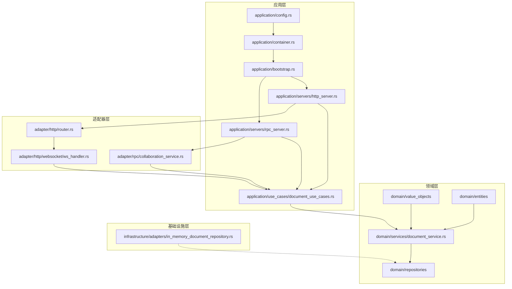
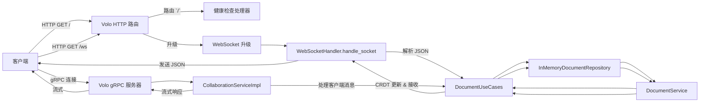

# Yjs 协作编辑服务器

中文 | [English](README.md)

[](https://www.rust-lang.org/) [](LICENSE)

高性能实时协作文档编辑服务器，基于 Rust、Yrs（Yjs 的 Rust 实现）以及 Volo HTTP & gRPC 构建。

## ✨ 功能特性

- 🚀 实时协作：多个客户端可以同时编辑同一文档。
- 🔄 基于 CRDT：无冲突复制数据类型，保证副本一致性。
- ⚡ 高性能：利用 Rust 和异步编程实现最大吞吐量。
- 🌐 WebSocket 支持：通过 HTTP `/ws` 端点进行实时双向通信。
- 🎧 gRPC 支持：双向流式和单次 RPC，用于协作（`Collaborate`、`GetDocumentState`、`GetActiveUsers`）。
- 🏗️ 整洁架构：领域、应用、基础设施层清晰分离。
- 🔒 强类型：Rust 的类型系统预防多类错误。
- ⚙️ 可配置性：通过环境变量控制 HTTP/gRPC 端口、日志级别与功能开关。

## 📦 关键依赖

- **volo** / **volo-http** / **volo-grpc**：核心 HTTP & RPC 框架。
- **yrs**：Rust 实现的 Yjs CRDT 协议。
- **tokio** / **futures-util**：异步运行时与工具库。
- **serde** / **sonic-rs**：JSON 序列化/反序列化。
- **once_cell**：延迟初始化支持。
- **uuid** / **base64**：客户端/文档标识与负载编码。
- **tracing** / **tracing-subscriber**：结构化日志与诊断。
- 更多详情请见 `Cargo.toml`。

## 🚧 路线图

- [ ] 基础设施
    - [ ] 缓存
        - [ ] 支持 Redis
        - [ ] 支持多级缓存
    - [ ] 存储
        - [ ] 支持 MySQL
        - [ ] 支持 MongoDB

- [ ] 连接管理
    - [ ] 心跳
    - [ ] 限流

- [ ] 日志与监控
    - [ ] 动态调整日志级别
    - [ ] 集成监控采集（例如 Prometheus）

- [ ] 部署
    - [ ] Docker 镜像
    - [ ] Kubernetes 部署

- [ ] 测试
    - [ ] 单元测试覆盖
    - [ ] 集成测试

- [ ] 性能优化
    - [ ] 算法优化
        - [ ] 仅增量更新
        - [ ] 压缩小更新
    - [ ] 并发优化
        - [ ] 无锁或细粒度锁
        - [ ] 减少上下文切换
    - [ ] 资源复用

- [ ] 服务注册与配置
    - [ ] Nacos

## 🏗️ 系统架构

下面的图表展示了系统的分层架构及组件之间的依赖关系。



### 详细请求流程

下面的序列图展示了客户端消息如何通过 WebSocket 和 gRPC 适配器到达文档用例，并将响应返回给客户端。



## 🚀 快速开始

### 环境要求

- Rust 1.60+（通过 [rustup](https://rustup.rs/) 安装）
- Cargo（Rust 包管理器）

### 安装

```bash
git clone https://github.com/Wenrh2004/yjs-collaboration-server.git
cd yjs-collaboration-server
cargo build --release
```

### 配置

默认同时启用 HTTP 与 gRPC 服务：

- `HTTP_ADDR`（默认 `[::]:8080`）
- `GRPC_ADDR`（默认 `[::]:8081`）
- `ENABLE_HTTP`（默认 `true`）
- `ENABLE_GRPC`（默认 `true`）
- `LOG_LEVEL`（默认 `info`）

### 运行

```bash
cargo run --release
```

- HTTP / WebSocket: `http://localhost:8080`（WebSocket 在 `/ws`）
- gRPC: 连接到 `localhost:8081`（参见 Protobuf 定义）

## 📚 API 文档

### HTTP / WebSocket

- `GET /`：健康检查（返回服务器状态）
- `GET /ws`：Yjs JSON 协议的 WebSocket 端点
    - 消息类型：
        - `sync`：同步请求
        - `update`：本地更新
        - `sv`：使用状态向量拉取缺失更新
    - 字段：`doc_id`、`update`（Base64 编码）等

### gRPC

连接到 `GRPC_ADDR` 定义的 gRPC 服务。服务定义位于 [`idl/collaboration.proto`](idl/collaboration.proto)：

```protobuf
service CollaborationService {
  rpc Collaborate(stream ClientMessage) returns (stream ServerMessage);
  rpc GetDocumentState(GetDocumentStateRequest) returns (GetDocumentStateResponse);
  rpc GetActiveUsers(GetActiveUsersRequest) returns (GetActiveUsersResponse);
}
```

- **Collaborate**：客户端消息 ↔ 服务端消息 的双向流。
- **GetDocumentState**：获取完整文档状态（状态向量、文档数据、活跃用户）。
- **GetActiveUsers**：获取文档当前活跃用户列表。

## 🧪 测试

```bash
cargo test
cargo tarpaulin --ignore-tests
```

## 🛠️ 开发

```bash
cargo fmt
cargo clippy -- -D warnings
cargo doc --open
```

## 🤝 贡献指南

1. Fork 本仓库到你的 GitHub 账号。
2. 克隆你的 fork 并添加上游仓库：
   ```bash
   git clone https://github.com/Wenrh2004/yjs-collaboration-server.git
   cd yjs-collaboration-server
   git remote add upstream https://github.com/Wenrh2004/yjs-collaboration-server.git
   ```
3. 创建新分支：
   ```bash
   git checkout -b feature/amazing-feature
   ```
4. 提交你的修改：
   ```bash
   git add .
   git commit -m "feat: 添加很棒的功能"
   ```
5. 同步上游并 rebase：
   ```bash
   git fetch upstream
   git rebase upstream/master
   ```
6. 推送到你的仓库并发起 Pull Request，说明你的改动。

## 📄 许可证

本项目采用 MIT 许可证，详见 [LICENSE](LICENSE)。

## 🙏 致谢

- [Yjs](https://yjs.dev/) - 协作应用的 CRDT 框架
- [Yrs](https://github.com/y-crdt/y-crdt) - Yjs 的 Rust 实现
- [Volo](https://www.cloudwego.io/volo/) - 高性能 HTTP/RPC 框架
